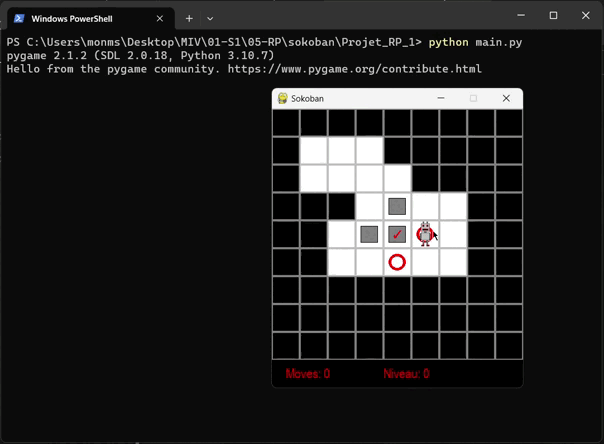

## Sokoban game
okoban is a classic puzzle video game created in Japan. The word "sokoban" translates to "warehouse keeper" in English. The game was first introduced in 1981 by Hiroyuki Imabayashi, and it quickly gained popularity. Sokoban has since become a classic and is enjoyed by puzzle enthusiasts around the world.

## About Our game
In addition to playing the game and solving different stages. We provide a way to solve each stage using the A* Algorithm. With implementation of  different heuristics.

## Usage
### Navigation 
* move up  `Up arrow key`
* move left  `Left arrow key`
* move right  `Right arrow key`
* move down  `Down arrow key`
    

### Solver
* Simple press the `Enter key`

### Enjoy